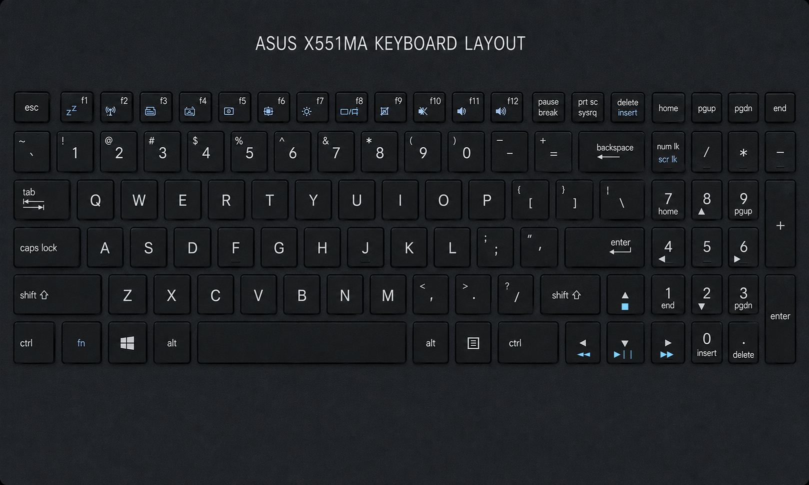

# TV Time

> Batteries? Where we're going, we don't _need_ batteries.

## The Background

My Roku remote died Friday, and I didn't have any batteries. So—armed with a low-spec 2014 laptop running Linux Mint, a Broadlink RM4 Mini IR Universal Remote, and Google—I set out to "replace" the batteries.

This is what I came up with by Saturday afternoon. All in all, it was a fun weekend project.

## The Process

### Step 1: Figure out how to control my non-Roku TV's volume

Luckily, I've used my RM4 Mini for this before. But I've never interacted with it outside the official Broadlink app.

A quick Google search produced [python-broadlink](https://github.com/mjg59/python-broadlink). Its last published version was two years ago and is available on PyPI; good enough for me.

Skimming the README, the method I'm mostly interested in is `device.send_data(packet)`. I'm not interested in re-teaching my device commands, though. One, because that's just annoying and time-consuming. And two—more importantly—because I haven't used the TV remote ever since teaching the Roku remote the power and volume commands, so those batteries have long since been repurposed (and are absent from said remote).

With that potential endeavor-ending roadblock in mind—because weekends are mostly for being lazy and this is supposed to be "for fun":

- I re-downloaded the Broadlink Android app.
- Logged into my Broadlink account, which I created years ago when I first got the device.
- And, luckily, it had all my previously taught commands for devices saved (all hail the mighty cloud!).
- Now, how to use this to my advantage? :thinking:

More Googling led me to numerous Home Assistant threads about how to set up the Broadlink device integration on the platform. On the integration page, there was something that gave me the idea to poke around my Android device's data: [Home Assistant: Broadlink Integration - Using e-control remotes](https://www.home-assistant.io/integrations/broadlink/#using-e-control-remotes).

So, after a few minutes of browsing through my device, I found a cache folder with a JSON file containing my device's commands.

> Bingpot!  
> <sub>(Shoutout to my fellow Brooklyn Nine-Nine fans)</sub>

Looks like I might be back in business.

The last small hurdle here was figuring out how to use the codes with `python-broadlink`. What threw me off was the fact that the codes didn't initially appear to be conventional hex values. Yet again, Google helped with that.

**Short answer:** They're still valid hex values, so just wrap the codes in `bytes.fromhex(...)` before passing them to `device.send_data(code)`.

All that's left for this step is actually coding the logic.

The first class—`main.TVRemote`—is born.

#### Small Roadblock: Device Is Locked!

The first test run of the newly minted class blew up almost immediately. After the initial connection was established, any commands attempted would raise an exception. Luckily, the `Device` class had an `is_locked` flag, which told me what the issue was. And the same Home Assistant link had a subheading ([Home Assistant: Broadlink Integration - Device is locked](https://www.home-assistant.io/integrations/broadlink/#device-is-locked)) for this very situation.

With that taken care of and the class properly handling this for future cases—onward!

### Step 2: Figure out how to control my Roku Stick

Luckily, I know Roku has well-established SDKs for interacting with its devices, so there's bound to be a few pre-existing packages utilizing them.

Another quick Google search produced [python-roku](https://github.com/jcarbaugh/python-roku). As expected.

Checking PyPI, though, it looks like it hasn't had any official releases for quite a few years. _However_, the commit history shows the author actively maintaining it. That's somewhat more important than the Broadlink piece because the majority of the commands _are_ focused around the Roku Stick.

So, I `uv add`ed the Git repo and pinned it to the latest commit as of writing this to preserve the package's current state for this project.

All that's left for this step is actually coding the logic.

`main.RokuStick` becomes the second class created.

#### Another Speed Bump: Control by Mobile Apps Is Off by Default!

This was only a mild inconvenience, but the cause was pretty annoying, as it had me feeling crazier than normal.

Turns out, while you _are_ able to control Roku devices using the _official_ app, the setting to allow other means of control is disabled by default. Google told me where in the settings I needed to go to enable _third-party_ control.

The setting is located at:

```text
Settings >
  System >
    Advanced system settings >
      Control by mobile apps >
        Limited (default) -> Enabled
```

Only problem is, when I navigated there, I didn't see the setting! Albeit, it was in the early AM at this point, so I figured I'd missed something.

Nope! Turns out there's a known "quirk" with newer Roku devices' firmware/software versions that _sometimes_ causes the setting to be hidden from _some_ users. The solution to get it to show up was an odd one, which I initially doubted.

- Open the Roku mobile app on the phone.
- Connect to the device.
- Immediately navigate to the above settings area.

And, unbelievably, it worked! Apparently, connecting from the official app briefly "fixes" the quirk and allows you to see the setting. It may or may not remain visible later once the device power cycles, but that's not a concern, so long as I'm able to update the setting now.

With that taken care of, _now_ we can move on. Next!

### Step 3: Figure out how to capture the laptop's keyboard events

Came across [pynput](https://pypi.org/project/pynput/)—I love me some cross-platform compatibility.

Since I want to block **all** keyboard input outside the application while it's running, `keyboard.Listener(..., suppress=True)` is perfect.

### Step 4: Map the keys to the appropriate class and method

Tacked on `key_map` properties and `dispatch_key` methods to both classes, so I can easily match and dispatch keyboard events to the appropriate device and device event.

#### Why I mapped the specific keys the way I did

This is a personal project, meant to run on a specific laptop with a specific keyboard layout.

Key mappings optimized for the ASUS X551MA laptop keyboard:



#### One Small Curveball: A Few Keys Were Not Predefined

Took me a few minutes to figure out how to convert the literal character produced in my `main.print_event_keys` helper function to actual `keyboard.Key` instances when they didn't already exist.

After looking through the documentation and code, the answer was to use a `keyboard.KeyCode` in those instances, creating it with `keyboard.KeyCode.from_char("-")`.

With that, the events produced by the listener will match the mappings and be properly dispatched.

Tackling that next!

### Step 5: Create a stateful class that manages all three concepts

1. `main.TVRemote`
2. `main.RokuStick`
3. `keyboard.Listener(..., suppress=True)`

This is where `main.MediaMonitor` materialized.

What it does:

- Holds a reference to each of the above.
- Upon a single `start()` call, it:
  - Creates an instance for each of the above.
  - Calls `.connect()` for both devices.
  - Starts the listener's thread, providing the callback that provides continued access to the devices within the thread.
  - Calls `join()` on the listener's thread, where it waits until the callback returns `False`, indicating that it's time to terminate the program.
- The `on_press` callback determines if a keypress is meaningful and, if so, dispatches to the appropriate device class instance thanks to the `key_map` and `dispatch_key` items created in the previous step.

From here, I have a functional replacement for my dead-battery situation. But there's one final feature I'd like to include.

### Step 6: Allowing text input under specific conditions

Since `keyboard.Listener(..., suppress=True)` blocks all keypresses that are not handled in the `on_press` callback, this required a bit of thinking.

Time to update `main.MediaMonitor`.

- Added a flag to indicate when typing is enabled (set by specific keys).
- Added an input buffer that gets appended to on each keypress of an allowed character.
- Accounted for realistic typing, allowing for backspacing, which `.pop()`s the last character from the buffer list.
- Upon hitting `Enter` while typing is enabled, join the entire buffer of characters into a string and send it to the `main.RokuStick.enter_text(...)` method.
- This had me learning about how to deal with `sys.stdout.write(...)` and `sys.stdout.flush()`. Not very fond of it. Already _flushed_ it from my memory (:awkward_husky_face_meme:).

### Step 7: Creating a convenient launcher

Created a simple shell script `tv-remote.sh` that:
- `cd`s to the project directory
- Activates the virtual environment
- Runs `main.py` as a module: `python -m main`

Once I marked it as executable (`chmod +x ./tv-remote.sh`) it worked like a charm. I didn't feel like selecting "Run in terminal" every time I clicked the script on my desktop to launch it, though. So, I decided to make a .desktop shortcut for the script. After another quick Google search and the help of `desktop-file-validate`, I had my one-click script. I even tracked down a suitable icon to make it stand out.

---

**Fin.**

Now it's time to resume my normal viewing habits.

Okay, it feels like it took me longer to create this write-up than it did to create the actual project. Is that a right-brain, left-brain thing? IDK. All I know is that you reached the end, so you deserve a cookie: :cookie:.

## Ignore the rest of this, unless you're bored

### Eventual TODOs / Improvements (if I feel like it)

- [ ] Convert the project layout to a proper package structure. I didn’t realize I was using `uv` version 0.11.8 when I started, where the default structure with `uv init` is a flat layout. That has since changed to a src layout starting in version 0.12.0 :expressionless:.
- [ ] Use proper logging :stuck_out_tongue:
- [ ] Make terminal output more appealing—and maybe semi-animated—using `rich`.
- [ ] Add a _non-interactive_ UI component that shows a Roku remote and the side buttons, along with the keys that correspond to the buttons. Maybe indicate keypresses on the remote as well.
  - [ ] TUI using `textual`
  - [ ] GUI using `kivy`

## Hardware

- Dead batteries
- Old Galaxy S7 Edge (running Android 8.0—Oreo)
- Broadlink RM4 Mini IR Universal Remote (the "bean")
- Roku 4K Streaming Stick
- Low-spec 2014 ASUS laptop (stats cherry-picked from `inxi -Fxz` and `sudo lshw -short`):
  - Intel(R) Celeron(R) CPU N2830 @ 2.16G
  - 4GiB System Memory DDR3 @ 1333 MHz
  - i915 Gen-7 Intel Atom Processor Z36xxx/Z37xxx Series Graphics & Display
  - Distro: Linux Mint 22.2 Zara
  - Kernel: 7.0.0-28-generic arch: x86_64 bits: 64 compiler: gcc v: 13.3.0
  - Desktop: Cinnamon v: 6.4.14
